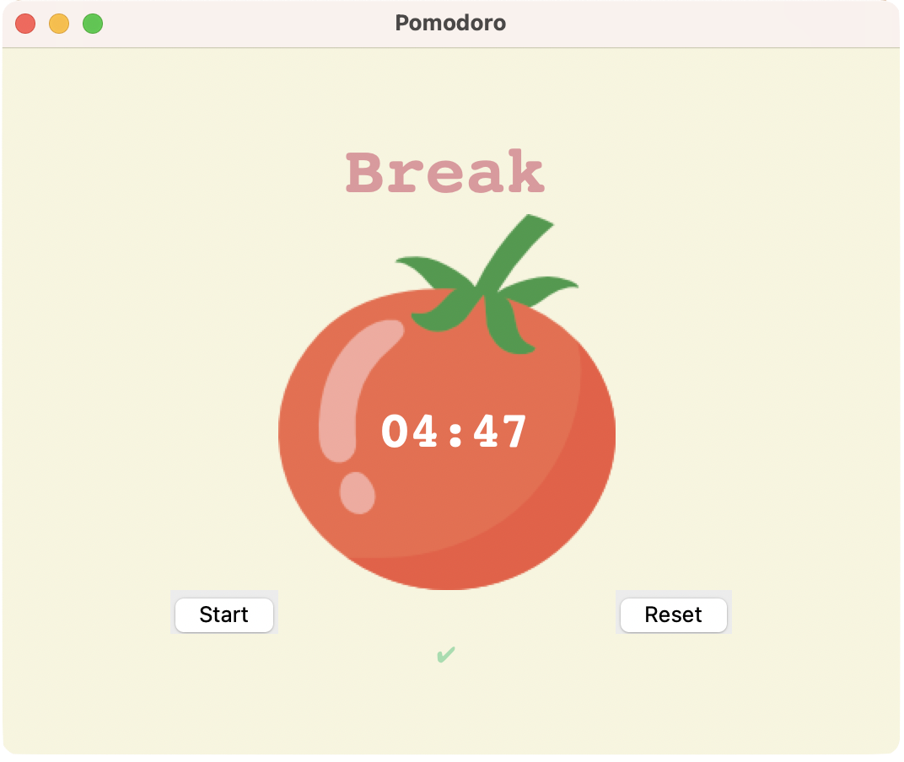

# Pomodoro Timer

This repository contains a Pomodoro Timer application developed using Python's tkinter library.

## Overview

The Pomodoro Timer is a productivity tool that helps you manage your time effectively. It follows the Pomodoro Technique, which involves working for a specific duration (e.g., 45 minutes) followed by a short break (e.g., 5 minutes). After completing a set number of work sessions, a longer break (e.g., 20 minutes) is taken.

## Features

- Simple and intuitive user interface
- Timer for work sessions, short breaks, and long breaks
- Visual indication of the current activity (work or break)
- Checkmarks to track the completed work sessions
- Start and reset buttons to control the timer

## Usage

1. Clone the repository to your local machine.
2. Run the `pomodoro.py` file to start the Pomodoro Timer application.
3. Click the "Start" button to begin the timer.
4. The timer will count down the work session duration.
5. After each work session, the timer will automatically switch to the appropriate break duration.
6. Checkmarks will appear to track the completed work sessions.
7. Click the "Reset" button to stop the timer and reset the progress.
8. Customize the duration of work sessions, short breaks, and long breaks by modifying the constants in the code.
